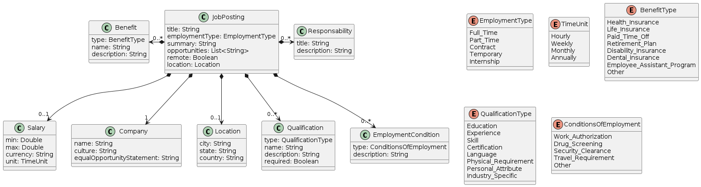

# Resume Analysis System

## Goal

The goal of this project is to develop an AI-powered system that provides personalized feedback to job applicants on how well their resume matches a specific job description. The system will analyze the resume and job description, identify gaps, and offer tailored advice to improve the applicant's chances of success. The system will also provide general application tips and allow users to interact with a chatbot to ask questions about the coaching report.

The key objectives include:

1. **Automated Resume Analysis:** The tool will automatically evaluates the user’s resume against specific job postings, identifying how well the candidate fits the role, where there are gaps, and what unique strengths to highlight.
2. **Coaching Reports:** Based on the analysis, the system generates personalized reports with tailored advice for improvement, suggestions on highlighting key skills, and specific recommendations to enhance job application success.
3. **Interactive Coaching:** Users will be able to interact with the system via a chatbot interface, which acts as a coach, answering queries and providing advice on job applications.

## Core Features:

1. **Resume-Job Comparison and Analysis:**
   - The system should compare a user’s resume with a provided job description.
   - It should identify the degree of fit between the resume and the job, highlighting strengths and areas that may need improvement.

2. **Coaching Report Generation:**
   - The system should generate a detailed coaching report, offering feedback on the match between the user’s resume and the job description.
   - The report should provide specific advice on:
     - Skills or experiences to emphasize.
     - Gaps or mismatches to address in the application.
     - General advice for tailoring the resume to the job.

3. **User-Friendly Web Application Interface:**
   - A web interface where users can upload their resume (in text or other supported formats) and paste a job description to get feedback.
   - The interface should be intuitive, allowing users to interact with the system easily.

4. **Chatbot for Interactive Coaching:**
   - A chatbot interface should allow users to ask questions and receive personalized coaching based on their resume and job description.

5. **Utilization of Large Language Models (LLMs):**
   - The system should leverage a pre-trained LLM (like Llama 3 or GPT-4) for generating resume advice and answering user queries.

6. **Deployment on AWS:**
   - The web application and LLM must be hosted on AWS for scalability and availability, using services such as EC2 for web hosting and potentially AWS Sagemaker for hosting the AI model.

## Multi-Agent System

### Agents

Below is a summary of the agents involved in the system, for detailed information on each agent, see [agents.yaml](backend/conf/agents.yaml).

| **Agent**               | **Role**                                                   | **Goal**                                           | **Backstory**                                  |
|-------------------------|------------------------------------------------------------|----------------------------------------------------|------------------------------------------------|
| **Data Extractor**      | Extract structured data from resumes and job descriptions. | Provide JSON-formatted data for further analysis.  | Expertise in data structuring and efficient extraction. |
| **Job Analysis Specialist** | Identify matches and gaps between resumes and job descriptions. | Provide constructive feedback and skill-building recommendations. | Specializes in objective, competency-based feedback. |
| **Career Coach**        | Provide personalized feedback for resume improvement.     | Suggest actionable steps for enhancing job compatibility. | Focus on motivational and constructive coaching. |

### Tasks

Below is a summary of the tasks involved in the system, for detailed information on each task, see [tasks.yaml](backend/conf/tasks.yaml).

| **Task**                     | **Description**                                               | **Agent Role**             | **Context**              | **Expected Output**                        |
|------------------------------|---------------------------------------------------------------|----------------------------|--------------------------|--------------------------------------------|
| **`extract_job_data`**        | Extract job details from descriptions based on a PlantUML structure. | Data Extractor             | N/A                      | JSON document with extracted job data.    |
| **`resume_job_fit_analysis`** | Analyze gaps between resumes and job descriptions.           | Job Analysis Specialist    | `extract_job_data`        | Detailed gap analysis report.             |
| **`generate_feedback`**       | Provide actionable and motivational feedback for resume improvement. | Career Coach               | `resume_job_fit_analysis` | Constructive feedback report.             |

## Semantic data transformation

This involves taking unstructured or semi-structured text (job descriptions) and transforming it into a structured format (such as JSON) based on a predefined schema or ontology, in this case, the PlantUML class definitions.

The process involves:

1. **Semantic Mapping**: Matching elements of unstructured text to predefined entities (e.g., `JobPosting`, `Responsibility`, `Qualification`) based on their semantics.
2. **Data Structuring**: Organizing the extracted information into a formal structure (JSON), adhering to the relationships and constraints defined in the `PlantUML` model.
3. **Schema-Aware Extraction**: Leveraging the `PlantUML` definitions to ensure the output aligns with the expected schema and relationships (e.g., `JobPosting` can have `0..*` `Qualification` elements).
