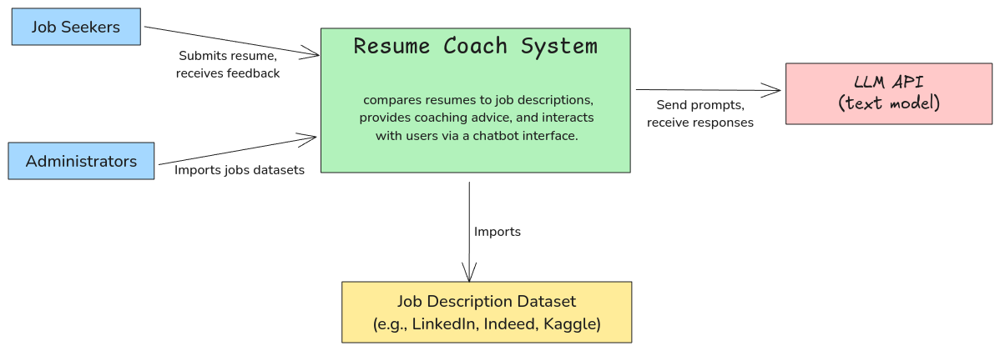
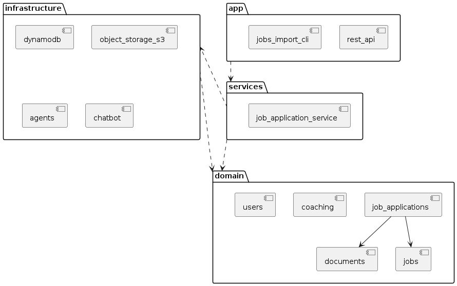

# AI-Powered Job Application Coach

The is an innovative, targeted career coaching platform designed to assist job seekers in crafting impactful and well-structured resumes tailored to specific job opportunities. Through this service, users gain access to personalized, AI-driven insights that highlight resume strengths, identify areas for improvement, and offer tailored advice on showcasing their experience effectively. With tools for resume-job comparison, tailored advice, and interactive AI guidance, candidates learn how to customize their resumes for each job application, optimizing their chances of success in the hiring process.

## System Context

1. **System - Resume Coach**:
     - The central software system. It is an AI-powered tool that compares resumes to job descriptions, provides coaching advice, and interacts with users via a chatbot interface. It uses large language models (LLMs) to generate recommendations.

2. **External Systems**:
   - **LLM API (e.g., Llama-3, GPT-4o)**: External service providing the AI capabilities needed to analyze resumes and job descriptions. The system integrates with this external API for generating coaching advice.
   - **Job Description Dataset (e.g., LinkedIn, Indeed, Kaggle datasets)**: External datasets that provide job descriptions for analysis and comparison, enhancing the functionality of the Resume Coach.
   - **Resume Parser**: An external component that parses resumes, extracting relevant information for the system to process.

3. **Users (Actors)**:
   - **Job Seekers**:
     - The primary users who upload their resumes and job descriptions to get personalized coaching advice.
   - **Administrators**:
     - Users who manage the system, configure settings and import datasets.

4. **Interactions**:
   - **Job Seekers ↔ Resume Coach**: Job seekers upload resumes and job descriptions, interact with the chatbot, and receive coaching reports.
   - **Resume Coach ↔ LLM API**: The Resume sends prompts to perform functions like parsing for analysis, report generation, and chats.
   - **Resume Coach ↔ Job Description Dataset**: Accesses job descriptions from datasets for analysis and comparison, providing a more comprehensive evaluation of resumes.

## Web Application

User-friendly platform designed to empower job seekers by enhancing their resumes to align with specific job opportunities. 

- **Input Your Resume and Job Description:** Users can upload their resume and paste a job description to receive a detailed analysis of the match between their experience and the job requirements.

- **Resume-Job Analysis:** Provides a comprehensive analysis of the user’s resume, highlighting strengths and areas for improvement based on the job description. Users receive tailored advice on how to optimize their resume for the specific role.

- **Interactive Chat for Report Queries:** Through an AI-driven chat feature, users can ask questions about their coaching report, clarifying feedback and receiving on-demand guidance to refine their application strategy.

# Backend Service

The Backend Storage Service is a dedicated backend service responsible for storing and managing user data, such as resumes, job descriptions, and generated coaching reports, using AWS DynamoDB as the primary database. It enables seamless data retrieval and tracking to support WebApp’s functionalities by interacting with the AI Coaching Agent Service to provide analysis and insights.

The backend service is composed of the following components:

## Application Layer

- **REST API**: provides a RESTful API interface for managing users, jobs, job applications, and coaching interactions.

- **Jobs Import CLI**: provides a command-line interface (CLI) for importing job listings from a CSV file, particularly jobs sourced from Indeed. Here’s a high-level summary of its responsibilities:

   1. Job Data Import and Parsing
   2. Token Counting
   3. Job Creation and Storage
   4. S3 and DynamoDB Integration

## Service Layer
The **JobApplicationService** component serves as the primary interface for managing users, jobs, job applications, and coaching interactions. Here’s a high-level summary of its responsibilities:

1. User Management
2. Job Management
3. Job Application Management
4. Coaching Report Generation
5. Chat-based Coaching Interaction

This component acts as a central service, connecting user, job, application, and coaching functionalities to provide a streamlined job application and coaching process, backed by document management and interactive feedback.

## Domain Layer
- **Job Applications:** Manages the creation, status updates, and persistence of job applications within a system.

- **Coaching:** Automated analysis with interactive feedback, supporting applicants throughout the application process.

   1. **Configuration**: Configurations files support flexible customization of agent behaviors and chatbot responses.

   2. **Job Application Analysis**: Analysis of the applicant’s resume in relation to the job description by using an `AgentSystem`. The function prepares necessary inputs (resume, job description, job data extraction) and triggers the agent execution to generate insights.

   3. **Chatbot Initialization and Management**: Sets up an interactive chatbot with a coaching context based on a provided coaching report and message history. The chatbot configuration and context allow personalized conversations with applicants, supporting continuous coaching.

   4. **Chat History Persistence**: This functionality ensures that ongoing coaching sessions maintain context across interactions.

- **Documents:** Manages the creation, storage, retrieval, and updating of various document types associated with the job application process. Handles interactions with Amazon S3, where documents are stored in a specific bucket and directory structure.

- **Jobs:** Manages job postings, including their creation, storage, and retrieval.

- **Users:** The users component is responsible for managing user accounts, including their creation, authentication, and storage. The authenticate method within the User class allows direct validation of a provided password against the stored hashed password.

